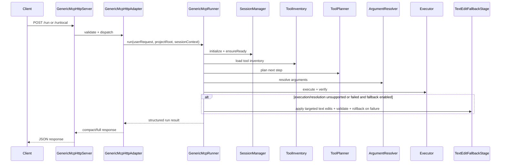

# factory-js

`factory-js` is the runtime orchestration layer for the Generic MCP workflow.

Source of truth for runtime behavior: `generic-mcp/`

## What This Service Does

Given a natural-language request, the runtime:
1. Connects to MCP/Godot bridge and verifies project readiness.
2. Discovers available tools live.
3. Plans the next tool step with an LLM.
4. Resolves generic arguments (paths, node refs, resource refs).
5. Executes mutation/read tools with precheck + readback verification.
6. Uses safe text-edit fallback (when enabled) for `.gd`/`.tscn` failures.
7. Returns a compact or full structured response.

## Directory Map (Where Is What)

- `generic-mcp/run-generic-mcp-server.js`
  HTTP sidecar entrypoint, runtime wiring, startup warmup.
- `generic-mcp/api/GenericMcpHttpServer.js`
  HTTP transport + route handling (`/health`, `/ready`, `/run`, `/runlocal`, `/resume`).
- `generic-mcp/api/GenericMcpHttpAdapter.js`
  Payload validation, session lifecycle mapping, compact/full response shaping.
- `generic-mcp/api/GenericMcpSessionStore.js`
  In-memory session + pending `needs_input` state.
- `generic-mcp/GenericMcpRunner.js`
  Core orchestrator/state machine (queueing, planning loop, fallback gates, completion).
- `generic-mcp/ToolPlanner.js`
  LLM planner; converts user intent into next executable tool step(s).
- `generic-mcp/ArgumentResolver.js`
  Generic argument normalization/resolution (scene/node/file/resource paths, aliases).
- `generic-mcp/Executor.js`
  Tool execution pipeline: precheck, mutation, post-readback validation, result normalization.
- `generic-mcp/TextEditFallbackStage.js`
  Transactional targeted text-edit fallback for `.gd`/`.tscn` with validation + rollback.
- `generic-mcp/SessionManager.js`
  MCP session transport, initialize retries, bridge/project readiness checks.
- `generic-mcp/ToolInventory.js`
  Live MCP tool discovery.
- `generic-mcp/ProjectFileIndex.js`
  Project file indexing for resolver/path policies.
- `generic-mcp/ResourceResolver.js`
  Generic path/resource matching over index.
- `generic-mcp/NodeResolver.js`
  Scene-node discovery support for node-targeted operations.
- `generic-mcp/ContentGenerationStage.js`
  Generated content/rewrite stage used when planner needs content artifacts.
- `generic-mcp/PostconditionVerifier.js`
  Workflow-level expected-effect verification.
- `generic-mcp/ResultPresenter.js`
  User-facing presentation synthesis from execution results.
- `generic-mcp/config/genericMcpServer.config.js`
  CLI/env config parsing (server, model, debug, limits).

## Runtime Workflow (How It Works)

## A) Sidecar Boot

1. Parse CLI/env config.
2. Load MCP config (`--mcp-config-json` > `--mcp-config-path` > default file).
3. Construct runtime modules (`SessionManager`, planners, resolver, executor, runner).
4. Start HTTP server.
5. Optional startup auto-init readiness gate (`--auto-init` default ON).

## B) Request Execution (`/run` or `/runlocal`)

1. Adapter validates JSON payload and resolves `sessionId` + `projectPath`.
2. Runner builds queue from request (single or multi-task).
3. For each step:
   - Ensure session ready (`initialize` + bridge/project match).
   - Load/refresh tool inventory.
   - Plan next step via `ToolPlanner`.
   - Resolve args via `ArgumentResolver`.
   - Execute via `Executor`.
   - Perform verification/postconditions.
4. If unresolved or failed and fallback enabled, attempt `TextEditFallbackStage`.
5. Return `completed | needs_input | paused | failed | unsupported`.
6. Persist pending continuation in session store when applicable.

## C) Resume (`/resume`)

1. Validate `sessionId` and pending state exists.
2. Continue same workflow state from paused/needs-input checkpoint.
3. Return updated compact/full result.

## Links Between Components (Who Calls What)

1. `run-generic-mcp-server.js` -> creates `GenericMcpHttpServer` + `GenericMcpHttpAdapter` + `GenericMcpRunner` instances.
2. `GenericMcpHttpServer` -> routes requests to `GenericMcpHttpAdapter`.
3. `GenericMcpHttpAdapter.handleRun/handleResume` -> calls `GenericMcpRunner.run(...)`.
4. `GenericMcpRunner` -> uses:
   - `SessionManager` (readiness)
   - `ToolInventory` (live tools)
   - `ToolPlanner` (LLM planning)
   - `ArgumentResolver` (argument synthesis/normalization)
   - `Executor` (tool execution + readback verification)
   - `TextEditFallbackStage` (safe fallback path)
   - `ResultPresenter` (final presentation)
5. `ArgumentResolver` -> uses `ResourceResolver`, `NodeResolver`, `ProjectFileIndex`.
6. `TextEditFallbackStage` -> uses model + MCP/client + local FS fallback + validators.

## Data Flow (Code/Data Flow)

1. **Input DTO**
   `input`, optional `projectPath`, optional `sessionId`, optional `responseMode`.
2. **Planner Output**
   structured step (`tool`, `args`, status, reason, missing/ambiguous metadata).
3. **Resolved Plan**
   normalized args (canonical paths/node refs/tool schema-compatible fields).
4. **Execution Output**
   tool raw result + generic verification result (`ok`, `reason`, expected effects).
5. **Workflow State**
   semantic state, feature flags, step history, queued tasks, pending gaps.
6. **HTTP Response**
   compact summary (default) or full internal structure.

## API Endpoints

Base URL default: `http://127.0.0.1:4318`

## `GET /health`

Liveness + summarized MCP/session status.

## `GET /ready?projectPath=/abs/path`

Strict readiness gate (MCP initialized, bridge ready, project path match).
- `200` when ready
- `503` when not ready

## `POST /run`

Run using **online** model config.

Request:
```json
{
  "input": "string (required)",
  "projectPath": "optional",
  "sessionId": "optional",
  "responseMode": "compact|full (optional)"
}
```

## `POST /runlocal`

Run using **local** model config.

Request shape same as `/run`.

## `POST /resume`

Resume paused/needs-input session.

Request:
```json
{
  "sessionId": "required",
  "input": "required",
  "projectPath": "optional",
  "responseMode": "compact|full (optional)"
}
```

Common HTTP errors:
- `400` invalid payload / missing required field / invalid JSON
- `404` route not found or session not found
- `409` resume with no pending state
- `413` body too large
- `415` unsupported content type

## Commands To Run API Mode

Minimal:
```bash
node ./generic-mcp/run-generic-mcp-server.js
```

Recommended explicit stdio adapter:
```bash
node ./generic-mcp/run-generic-mcp-server.js \
  --client-module "./generic-mcp/adapters/stdio-mcp-client.js" \
  --host 127.0.0.1 \
  --port 4318
```

With default project + debug:
```bash
node ./generic-mcp/run-generic-mcp-server.js \
  --default-project-path "/absolute/path/to/godot-project" \
  --debug
```

Disable startup warmup:
```bash
node ./generic-mcp/run-generic-mcp-server.js --no-auto-init
```

Quick calls:
```bash
curl -s http://127.0.0.1:4318/health
curl -s "http://127.0.0.1:4318/ready?projectPath=/absolute/path"
curl -s http://127.0.0.1:4318/runlocal -H "Content-Type: application/json" -d '{"input":"..."}'
curl -s http://127.0.0.1:4318/run -H "Content-Type: application/json" -d '{"input":"..."}'
curl -s http://127.0.0.1:4318/resume -H "Content-Type: application/json" -d '{"sessionId":"...","input":"..."}'
```

## LLD (Low-Level Design)



Core step loop in `GenericMcpRunner`:
1. Plan
2. Resolve
3. Execute
4. Verify postconditions
5. Continue until done/safety bound/failure/needs-input

## Debug and Flags

- Global sidecar debug: `--debug` or `GENERIC_MCP_HTTP_DEBUG=true`
- Verify/planner debug: `DEBUG_GENERIC_MCP_VERIFY=true`
- Executor debug: `DEBUG_GENERIC_MCP_EXECUTOR=true`
- Fallback debug: `DEBUG_GENERIC_MCP_FALLBACK=true`
- Presenter debug: `DEBUG_GENERIC_MCP_PRESENTER=true`
- Resolver debug: `DEBUG_GENERIC_MCP_RESOLVER=true`
- Index debug: `DEBUG_GENERIC_MCP_INDEX=true`

Note: text-edit fallback is workflow-gated and runs only when enabled in workflow feature flags and failure conditions are met.

## Reliability Notes

- Session readiness is explicitly gated before execution.
- Tool inventory is refreshed and validated before use.
- Execution includes precheck + readback verification.
- Text-edit fallback is transactional with validation and rollback.
- Step-loop safety bounds prevent infinite unproductive retries.
